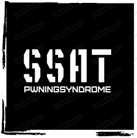

# SSAT 

SSAT(Samsung Security Assessment Team) is a CTF team to enjoy the wargames, from PwningSyndrome.

SSAT regurarly participates in the CTF events and makes write-ups, but our writeup repository is private.

# PwningSyndrome

PwningSyndrome is an offensive security research group consists of security researchers and their colleagues in Samsung Electronics.

We are mainly interested in reverse engineering, cryptography, web/binary vulnerabilities, exploitations, and etc.

# Members

| member       | note         |
|:------------:|:-------:|
| banana       |         |
| einstrasse   |         |
| freestar     |         |
| galaxy       |         |
| greenland_shark|         |
| [matta](https://me.matta.kr) | Manager of SSAT and PwningSyndrome |
| the13        |         |
| zizihacker   |         |

### Contact to us

Please mail to matta(js00n.park(at)samsung.com)
